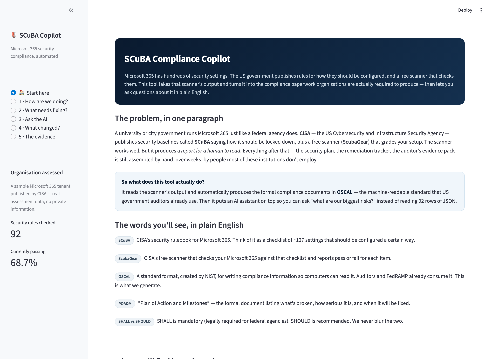
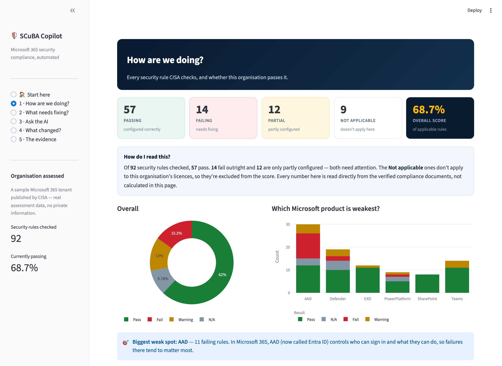
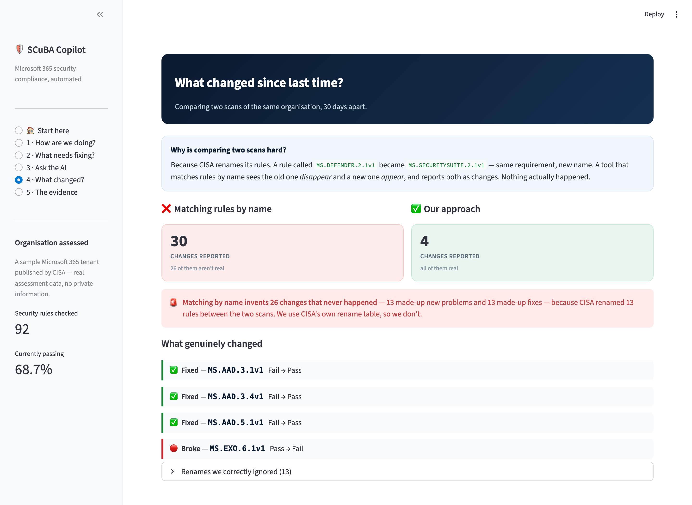
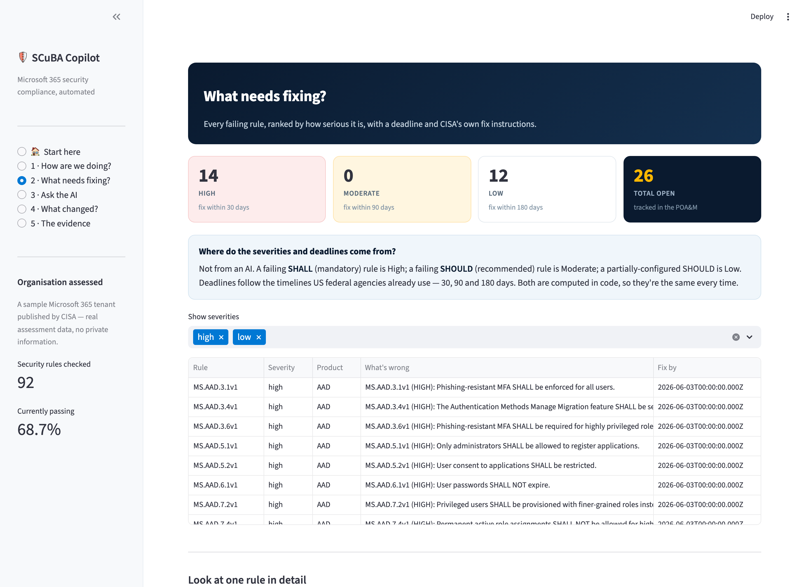
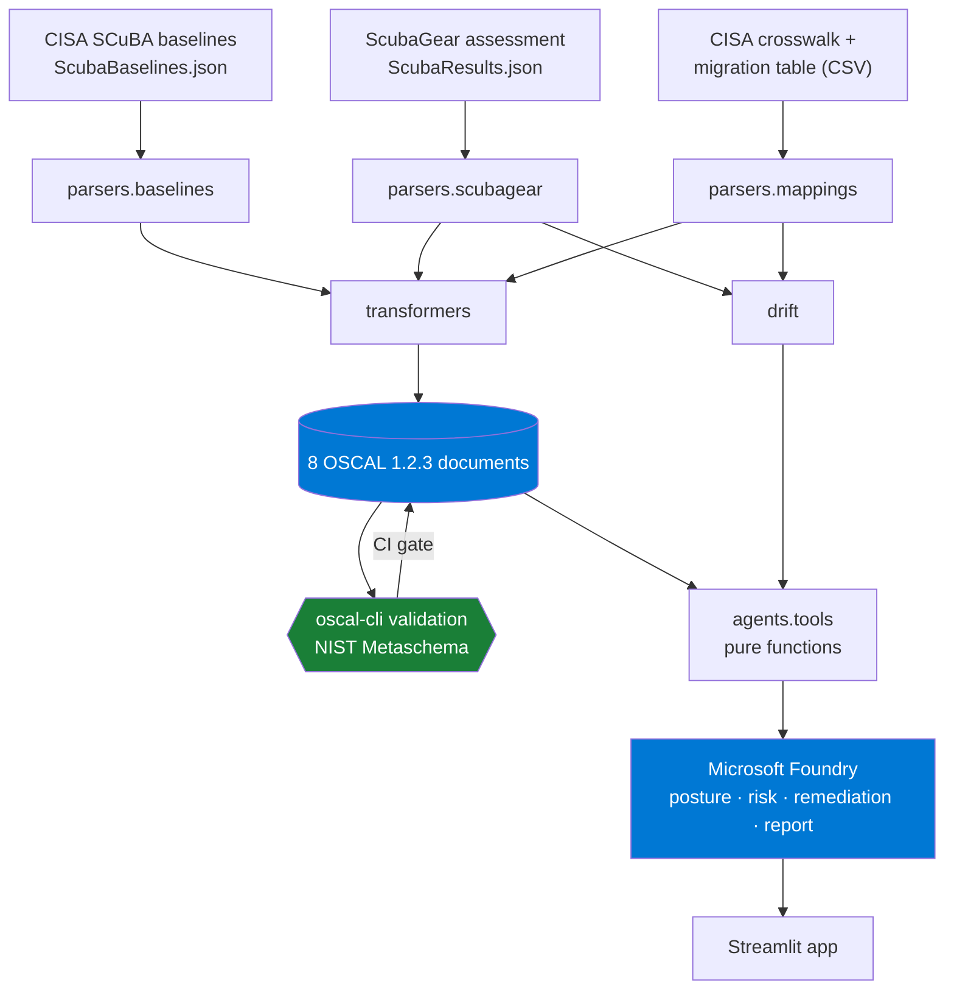

# SCuBA Compliance Copilot

**Turning CISA's SCuBA guidance and ScubaGear assessments into validated OSCAL — with an AI layer that reasons over the artifacts without inventing compliance facts.**

Built for the **Microsoft & CCI Innovation Challenge for Virginia** (Sept 2026),
Challenge: *"SCuBA Security Application — OSCAL-based representation of SCuBA
security baseline content and/or assessment results."*

[](https://github.com/saleha-muzammil/microsoft-sec/actions/workflows/ci.yml)
· OSCAL 1.2.3 · Microsoft Foundry · Apache-2.0

---



## The problem

CISA publishes the **SCuBA** secure configuration baselines for Microsoft 365 and
**ScubaGear**, a scanner that grades a tenant against them. Under **Binding
Operational Directive 25-01** these baselines are mandatory for federal civilian
agencies, and they are fast becoming the de facto standard for state, local and
academic institutions too.

But ScubaGear's output is a report for a human to read. It is not
machine-readable compliance evidence. So every downstream activity — writing a
System Security Plan, producing a Plan of Action and Milestones, answering an
auditor, mapping to NIST 800-53 for an ATO package — is done **by hand, in
spreadsheets and Word documents**.

**CISA started building the bridge and stopped.** The
[`oscal-exploration`](https://github.com/cisagov/ScubaGear/tree/oscal-exploration)
branch of ScubaGear has not been touched since **August 2024**, was never merged,
and its own README concedes:

> *"you can't have an assessment plan model without implementing all the
> preceeding layers"*

…leaving component-definition, SSP and POA&M as **TODO**.

**This project finishes that bridge, and adds the reasoning layer on top.**

---

## What it does

```
CISA SCuBA baselines (127 policies)  ─┐
                                      ├─►  deterministic Python  ─►  8 OSCAL documents
CISA ScubaGear assessment (92 checks) ─┘         (50 tests)          all NIST-validated
                                                                            │
                                                                            ▼
                                                              Microsoft Foundry agents
                                                              (answer only from artifacts)
```

### 1. The complete OSCAL chain

All eight documents validate against NIST's own validator — `oscal-cli` 3.2.0 /
`liboscal-java` 7.2.0 — with **full Metaschema constraints**, not merely JSON Schema.

| OSCAL model | What it carries |
|---|---|
| `catalog` | 127 SCuBA policies, CISA rationale, implementation guidance, MITRE ATT&CK, SHALL/SHOULD |
| `profile` | The controls this assessment actually covered |
| `component-definition` | The M365 services under assessment |
| `system-security-plan` | The tenant and its in-scope controls |
| `assessment-plan` | The procedure ScubaGear performs |
| `assessment-results` | 92 observations · 83 findings · 26 risks |
| `plan-of-action-and-milestones` | 26 prioritised items with deadlines |
| `mapping-collection` | SCuBA → NIST 800-53 Rev 5, with provenance |

> The last three did not exist in any published SCuBA tooling.

### 2. Mappings provably faithful to CISA

CISA publishes an authoritative SCuBA → NIST 800-53 crosswalk. We **bind to it**
rather than asking a model to guess, because a mapping that contradicts the
source of truth is a defect, not a feature.

| Resolution path | Count |
|---|---|
| Direct entry in CISA's crosswalk | 71 |
| Via CISA's baseline migration table | 13 |
| **Deterministic total** | **84 / 92 (91%)** |
| Left for AI proposal — labelled, confidence-scored, human-approved | 8 |

A CI test reads CISA's CSV **independently of our own parser** and fails the
build on any divergence. It also pins a case where published third-party tooling
gets it wrong: `MS.AAD.1.1v1` maps to **`CM-7`** (least functionality — disabling
legacy auth), not `IA-2(1)` (an MFA control).



### 3. Drift that survives baseline version changes

SCuBA policy IDs are versioned, and CISA revises them. Between two runs,
`MS.DEFENDER.*` became `MS.SECURITYSUITE.*`. A tool matching on identifier
reports each renumbered policy **twice** — once vanished, once new:

| | Identifier matching | Version-aware |
|---|---|---|
| Phantom new findings | **13** | 0 |
| Phantom resolved findings | **13** | 0 |
| Renumberings recognised | 0 | 13 |
| Real improvements | 3 | 3 |
| Real regressions | 1 | 1 |

**26 fabricated events** — corrupting exactly the numbers a compliance report is
built on. We consume CISA's own migration table, so the count is right.



### 4. An AI layer that cannot fabricate

Four Microsoft Foundry specialists — posture, risk, remediation, report — share
one rule: **never state a compliance fact that did not come from a tool call.**
Every tool is a pure function over a NIST-validated document.

So *"how do you know the model didn't invent that number?"* has a concrete
answer: **it couldn't have**, and [`tests/test_agent_tools.py`](tests/test_agent_tools.py)
proves the tools return what the artifacts contain.

### 5. Semantic retrieval over baseline guidance (Azure AI Search)

Engineers arrive with a *problem*, not a policy ID. Keyword search cannot help
with *"someone could trick a user into approving a malicious app"* — none of
those words appear in the baseline text. Vector search over CISA's guidance,
embedded with `text-embedding-3-large`, returns:

| Policy | Title |
|---|---|
| **MS.AAD.5.2v1** | User consent to applications SHALL be restricted |
| MS.TEAMS.5.2v2 | Only allow installation of approved third-party apps |

Two deliberate constraints keep this safe:

- **Retrieval is never a source of compliance facts.** It returns policy IDs; the
  authoritative requirement, result and mapping are still read from validated
  OSCAL. A retrieval miss can make an answer less complete — never wrong.
- **It is optional.** Without Azure AI Search the tool falls back to keyword
  search, and every test still passes. The demo never depends on a second cloud
  service being healthy.

### 6. Prioritised remediation, traceable to OSCAL

Each failing policy carries its severity, deadline, CISA rationale, implementation
guidance, MITRE ATT&CK techniques, and NIST mapping — with provenance shown, so a
CISA-published mapping never looks like an AI-proposed one.



---

## Quickstart

```bash
git clone https://github.com/saleha-muzammil/microsoft-sec.git && cd microsoft-sec
python3.12 -m venv .venv && source .venv/bin/activate && pip install -e ".[app,dev]"
./scripts/install_tools.sh                  # NIST oscal-cli (needs Java 17+)
python scripts/generate.py                  # build all 8 OSCAL documents
python scripts/validate_all.py              # prove they validate
```

That runs entirely offline against CISA's published sample data. For the AI layer:

```bash
cp .env.example .env    # fill in your Foundry endpoint, then `az login`
streamlit run src/scuba_oscal/app/main.py
```

Optional — semantic retrieval over baseline guidance:

```bash
pip install -e ".[search]"
python scripts/build_search_index.py     # embeds 127 policies into Azure AI Search
```

Other entry points:

```bash
python scripts/drift_report.py          # naive vs version-aware drift
python scripts/make_followup_run.py     # regenerate the follow-up fixture
pytest -q                               # 50 tests
```

---

## Architecture



**The load-bearing design decision:** parsing and OSCAL generation are plain,
typed, tested Python. No model decides what a control ID is, what a test result
was, or what belongs in a required schema field. AI is layered *on top*, where
judgement genuinely helps — prioritisation, explanation, narrative — and is
structurally prevented from touching the facts.

---

## Why this matters

CISA's baselines are **mandatory** for federal civilian agencies under BOD 25-01,
and Virginia's public universities, school divisions and local governments run
the same Microsoft 365 estate with a fraction of the compliance staff.

For an organisation without a dedicated GRC team, the gap between *"we ran the
scanner"* and *"we have an auditable compliance package"* is measured in weeks of
manual work. This pipeline closes it in seconds, and produces artifacts in the
format FedRAMP and federal assessors already consume.

---

## Responsible AI

See [`docs/RESPONSIBLE_AI.md`](docs/RESPONSIBLE_AI.md). In short: the model is
architecturally barred from asserting compliance facts, every mapping carries
provenance, AI-authored remediation prose is tagged `generated-by=ai-assistant`,
and untestable policies are reported as `EXAMINE` rather than `TEST` so the
artifacts never overstate what was machine-verified.

## Data, licensing and scope

- Input is CISA's **published sample assessment** (`ScubaResults_fa5589b7…json`),
  a real redacted run shipped in the ScubaGear repository under **CC0-1.0**. No
  live tenant was scanned; no tenant or personal data appears anywhere.
- The follow-up run used for drift is **derived** from that sample by
  [`scripts/make_followup_run.py`](scripts/make_followup_run.py) and is labelled
  as derived **inside the file**, not only here.
- ScubaGear and the SCuBA baselines are **CC0-1.0**. NIST OSCAL is a U.S.
  Government work. See [`NOTICE`](NOTICE).
- This project is **not** a CISA or Microsoft product and carries no endorsement.
- **Defensive only.** This repository contains no exploit code, offensive
  tooling, or credential testing. It reads assessment output and produces
  compliance documents.

### Honest limitations

- `oscal-cli` 3.2.0 has no `mapping` command — the Control Mapping model is new
  in OSCAL 1.2 — so that one document is JSON-Schema validated only. The
  validator reports this as `cli:n/a` rather than implying more.
- ScubaGear itself is Windows/PowerShell-only, so this project consumes its
  output rather than running it.
- 8 of 92 policies have no CISA-published NIST mapping. We surface them as
  unmapped instead of guessing.

## Licence

[Apache-2.0](LICENSE). Third-party attribution in [`NOTICE`](NOTICE).
