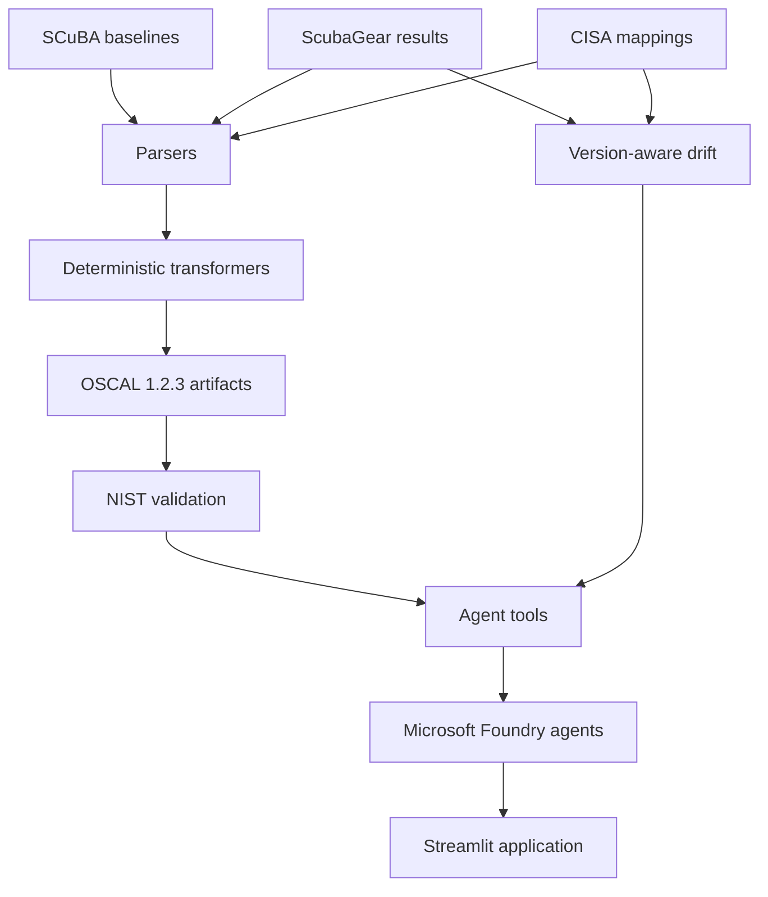

# SCuBA Compliance Copilot

**Turn CISA SCuBA and ScubaGear assessments into validated OSCAL artifacts, with an AI layer grounded entirely in those artifacts.**

Built for the **Microsoft & CCI Innovation Challenge for Virginia** (Sept. 2026).

[](https://github.com/saleha-muzammil/microsoft-sec/actions/workflows/ci.yml)

`OSCAL 1.2.3` · `Microsoft Foundry` · `Apache-2.0`

---

## Overview

CISA's **SCuBA** provides secure configuration baselines for Microsoft 365, while **ScubaGear** assesses a tenant against those baselines. ScubaGear produces reports for human review, but the results are not directly available as machine-readable OSCAL compliance evidence.

**SCuBA Compliance Copilot bridges that gap.**

The project deterministically transforms SCuBA baselines, ScubaGear assessment results, and CISA's published mappings into a complete set of OSCAL artifacts:

```text
SCuBA baselines ───────┐
                       ├──► Deterministic pipeline ──► OSCAL artifacts
ScubaGear results ─────┤                              │
                       │                              ▼
CISA mappings ─────────┘                       Microsoft Foundry
                                                      │
                                                      ▼
                                              Streamlit application
```

The AI layer operates **on top of validated artifacts**. It does not determine control IDs, assessment results, mappings, or other compliance facts.

---

## What it produces

The pipeline generates eight OSCAL 1.2.3 documents:

| Artifact                        | Purpose                                           |
| ------------------------------- | ------------------------------------------------- |
| `catalog`                       | SCuBA policies, rationale, guidance, and metadata |
| `profile`                       | Controls covered by the assessment                |
| `component-definition`          | Microsoft 365 components under assessment         |
| `system-security-plan`          | Assessed tenant and implemented requirements      |
| `assessment-plan`               | Assessment procedures                             |
| `assessment-results`            | Observations, findings, and risks                 |
| `plan-of-action-and-milestones` | Prioritized remediation items and deviations      |
| `mapping-collection`            | SCuBA → NIST 800-53 mappings with provenance      |

All generated artifacts are gated by **NIST OSCAL 1.2.3 JSON Schema validation**. CI additionally validates the artifacts with NIST's `oscal-cli` where supported.

### Key results

* **8/8** OSCAL documents pass JSON Schema validation
* **7/8** also pass `oscal-cli` validation; the remaining mapping document uses an OSCAL model not supported by the current CLI
* **89/92** policy mappings are resolved deterministically from CISA sources
* **26** prioritized POA&M items are generated
* Version-aware comparison prevents **26 phantom drift findings** caused by policy renumbering
* AI evaluation achieved **100% pass rate** on the grounded architecture compared with **80%** for the raw-context baseline
* Fabrication check across both arms: the grounded agents asserted **0 identifiers absent from the evidence**; the ungrounded baseline asserted **6** (including five invented MITRE technique IDs) — see `evals/comparison.json`

---

## Grounded AI

The application provides specialized agents for:

* compliance posture
* risk analysis
* remediation
* reporting

Agents access compliance information through tools that read the validated OSCAL artifacts.

The core design rule is:

> **The model can explain and prioritize compliance evidence, but it cannot create the evidence.**

This prevents the model from inventing control IDs, findings, mappings, or compliance statistics.

Semantic retrieval is also available through Azure AI Search. Retrieval helps locate relevant SCuBA policies, but **retrieved text is never treated as compliance evidence**.

### Output audit — the other half of grounding

Constraining what goes *into* the model is half the story. The other half runs after it answers: every live answer is deterministically audited (`src/scuba_oscal/grounding.py`) — each SCuBA policy ID, NIST 800-53 control, MITRE ATT&CK technique and OSCAL UUID it asserts is checked against the evidence corpus, and anything the evidence has never seen is flagged **on screen, before anyone acts on it**. An identifier the user's own question introduced is treated as quotation, not fabrication, so the agent can safely say "no such policy exists."

This is the same detector the published eval uses — one piece of tested code produces both the badge on every answer and the numbers in `evals/comparison.json`.

Each verified citation is also **traceable**: the app resolves it to the exact node in the validated OSCAL documents that carries it — the requirement in the catalog, the observation in the assessment results, the POA&M item — so "show me the evidence" is one click, not a grep.

---

## Additional capabilities

### Version-aware drift

SCuBA policy identifiers change between baseline versions. The project uses CISA's migration data to distinguish genuine changes from simple renumbering.

### Exemption tracking

ScubaGear omissions are represented explicitly in OSCAL rather than silently disappearing from the assessment denominator. Exemptions carry their status and expiration information into the POA&M.

### Threat coverage

SCuBA policies mapped to MITRE ATT&CK techniques are used to measure remaining coverage and identify techniques with no surviving mitigation.

### Bring your own scan

Any `ScubaResults*.json` can be processed through the same pipeline used for the included sample data.

Uploaded scan data is treated as **untrusted input** and instruction-like text is neutralized before reaching the AI layer.

### Virginia SEC530 mapping

SCuBA findings can be connected to Virginia's **SEC530** requirements through their shared NIST 800-53 control identifiers.

### Provenance you can re-check

Every generated document carries, **inside its own metadata**, the SHA-256 of each input it was produced from — the ScubaGear scan, the baselines, CISA's crosswalk, and the exemption config. Rehash the input and compare: if the digests match, the artifact came from exactly that scan. The claim travels with the document, not with this repository.

### Version-skew detection

The scanner and the baseline documents version independently. The app reports any policy the scan assessed that the baseline catalog does not define, rather than silently narrowing the join — CISA's own published sample exhibits exactly one such policy (`MS.SHAREPOINT.3.3v1`).

---

## Architecture



The load-bearing design decision is that **parsing, transformation, mapping, and OSCAL generation are deterministic Python code**. AI is used only where interpretation and explanation are useful.

---

## Quickstart

### 1. Install

```bash
git clone https://github.com/saleha-muzammil/microsoft-sec.git
cd microsoft-sec

python3.12 -m venv .venv
source .venv/bin/activate

pip install -e ".[app,dev]"
./scripts/install_tools.sh
```

### 2. Generate and validate OSCAL

```bash
python scripts/generate.py
python scripts/validate_all.py
```

This runs against the included CISA sample data and does not require an Azure account.

### 3. Run the application

For the AI layer:

```bash
pip install -e ".[ai]"
cp .env.example .env

az login
streamlit run src/scuba_oscal/app/main.py
```

The AI layer uses **Microsoft Foundry** and Azure CLI authentication. No API keys are stored in the repository.

### Optional semantic search

```bash
pip install -e ".[search]"
python scripts/build_search_index.py
```

### Tests

```bash
pytest -q
```

---

## Repository structure

```text
src/
├── scuba_oscal/
│   ├── parsers/          # SCuBA, ScubaGear, and CISA mapping parsers
│   ├── transformers/     # OSCAL generation
│   ├── drift/            # Version-aware comparison
│   ├── agents/           # Foundry agents and tools
│   └── app/              # Streamlit application

scripts/                   # Generation, validation, search, and evaluation
tests/                     # Unit and integration tests
docs/                      # Detailed methodology and responsible AI documentation
evals/                     # Grounded vs. ungrounded evaluation
```

---

## Data and scope

The included demonstration uses CISA's published ScubaGear sample assessment. No live tenant is scanned.

The project is **not a CISA or Microsoft product** and carries no endorsement.

It is designed for defensive compliance and assessment workflows and contains no exploit code or offensive tooling.

See [`docs/RESPONSIBLE_AI.md`](docs/RESPONSIBLE_AI.md) for the AI safety and provenance design.

See [`NOTICE`](NOTICE) for third-party attribution.

---

## License

[Apache-2.0](LICENSE)
