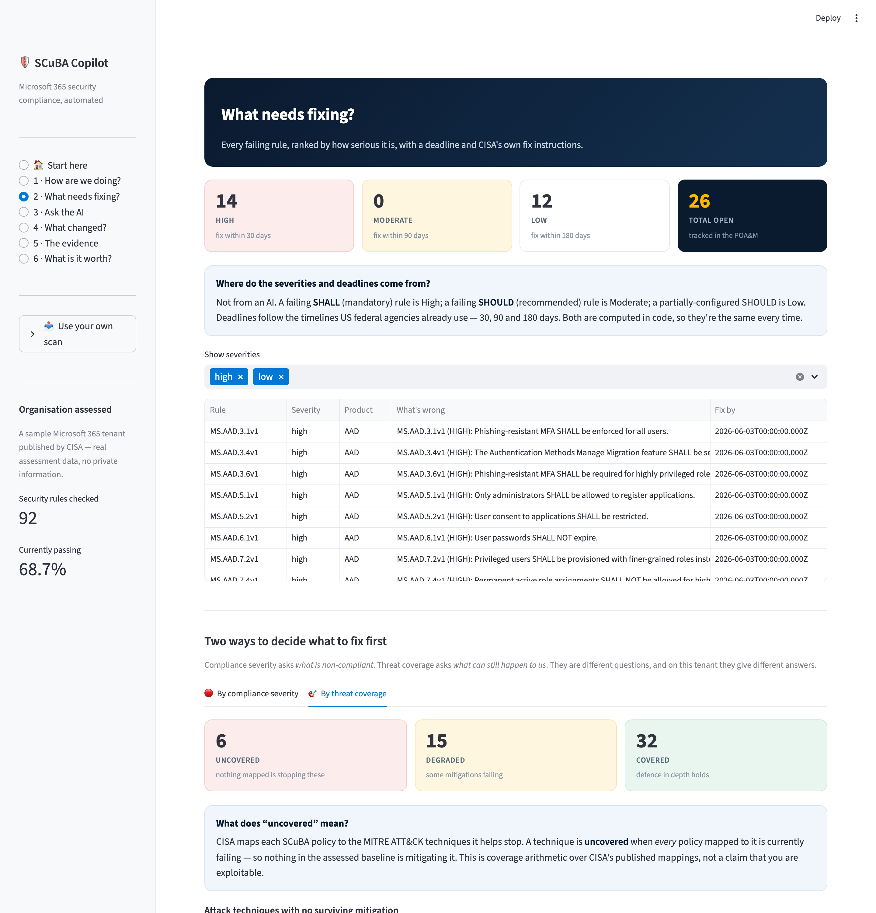
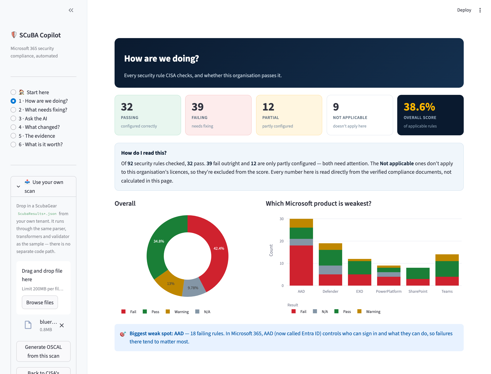
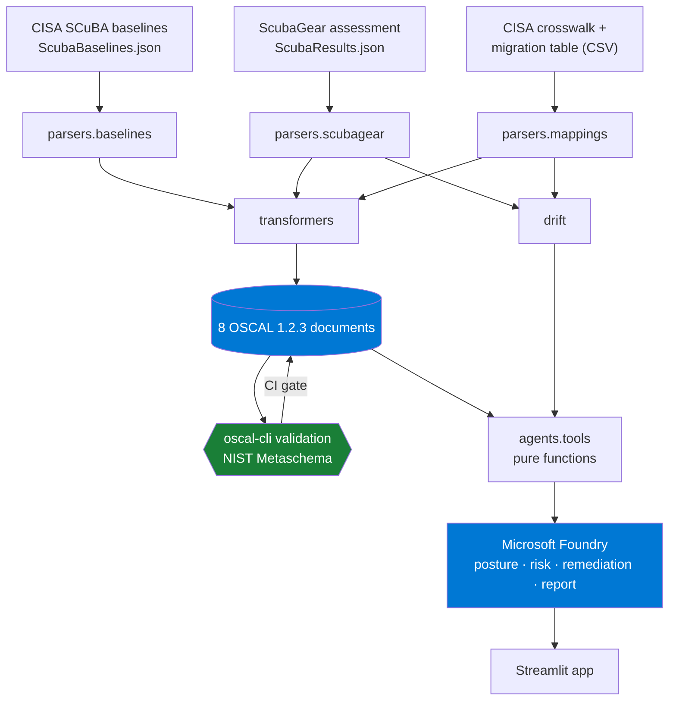
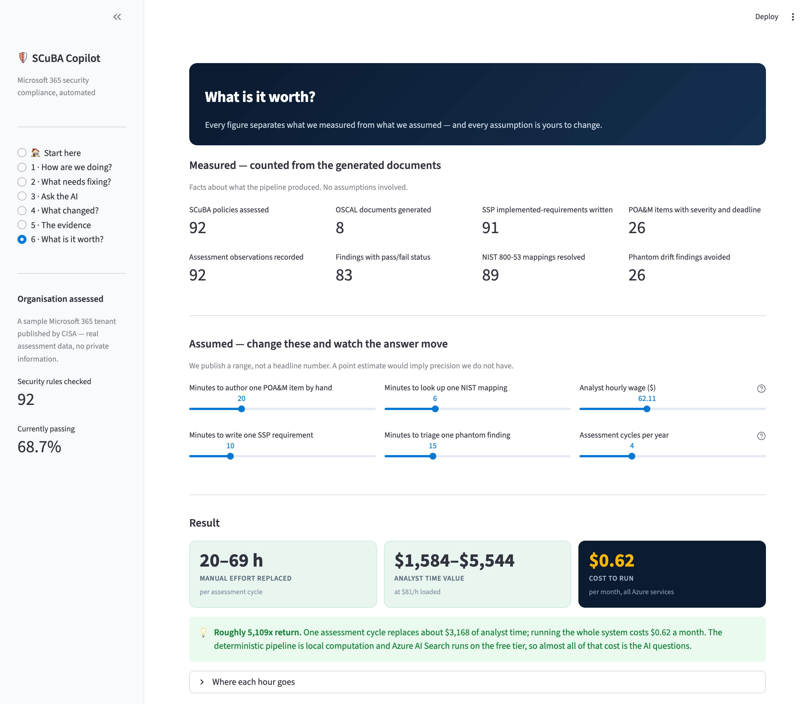
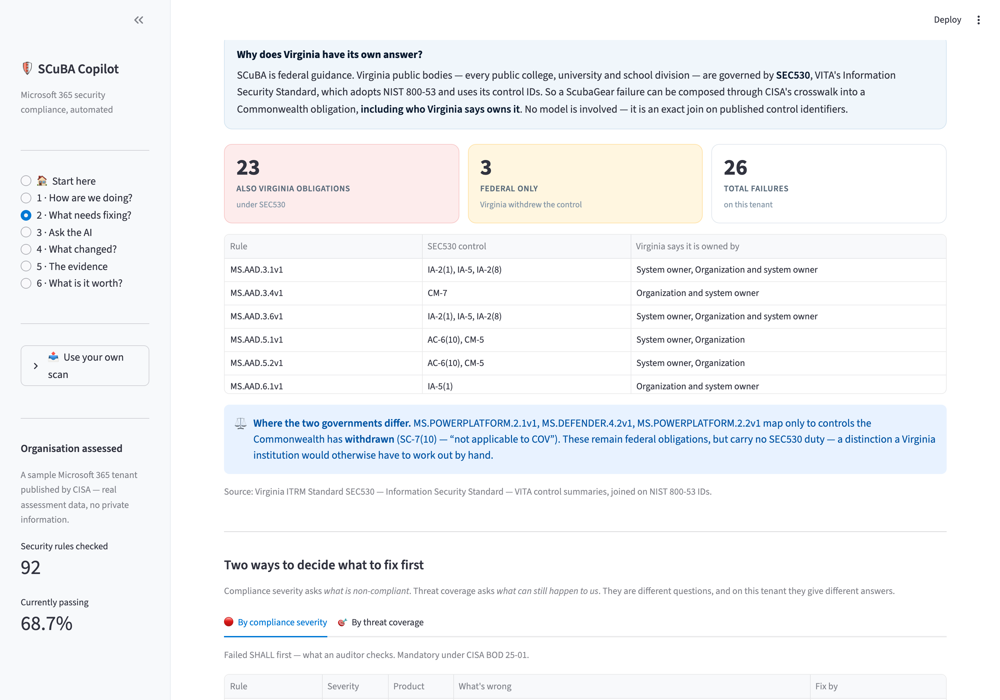

# SCuBA Compliance Copilot

**Turning CISA's SCuBA guidance and ScubaGear assessments into validated OSCAL — with an AI layer that reasons over the artifacts without inventing compliance facts.**

Built for the **Microsoft & CCI Innovation Challenge for Virginia** (Sept 2026),
Challenge: *"SCuBA Security Application — OSCAL-based representation of SCuBA
security baseline content and/or assessment results."*

[](https://github.com/saleha-muzammil/microsoft-sec/actions/workflows/ci.yml)
· OSCAL 1.2.3 · Microsoft Foundry · Apache-2.0

---


## The problem

CISA publishes the **SCuBA** secure configuration baselines for Microsoft 365 and
**ScubaGear**, a scanner that grades a tenant against them. Under **Binding
Operational Directive 25-01** these baselines are mandatory for federal civilian
agencies, and they are fast becoming the de facto standard for state, local and
academic institutions too.

But ScubaGear's output is a report for a human to read. It is not
machine-readable compliance evidence. So every downstream activity — writing a
System Security Plan, producing a Plan of Action and Milestones, answering an
auditor, mapping to NIST 800-53 for an ATO package — is done **by hand, in
spreadsheets and Word documents**.

**CISA started building the bridge and stopped.** The
[`oscal-exploration`](https://github.com/cisagov/ScubaGear/tree/oscal-exploration)
branch of ScubaGear has not been touched since **August 2024**, was never merged,
and its own README concedes:

> *"you can't have an assessment plan model without implementing all the
> preceeding layers"*

…leaving component-definition, SSP and POA&M as **TODO**.

**This project finishes that bridge, and adds the reasoning layer on top.**

---

## What it does

```
CISA SCuBA baselines (127 policies)  ─┐
                                      ├─►  deterministic Python  ─►  8 OSCAL documents
CISA ScubaGear assessment (92 checks) ─┘         (59 tests)          all NIST-validated
                                                                            │
                                                                            ▼
                                                              Microsoft Foundry agents
                                                              (answer only from artifacts)
```

### 1. The complete OSCAL chain

All eight documents validate against NIST's own validator — `oscal-cli` 3.2.0 /
`liboscal-java` 7.2.0 — with **full Metaschema constraints**, not merely JSON Schema.

| OSCAL model | What it carries |
|---|---|
| `catalog` | 127 SCuBA policies, CISA rationale, implementation guidance, MITRE ATT&CK, SHALL/SHOULD |
| `profile` | The controls this assessment actually covered |
| `component-definition` | The M365 services under assessment |
| `system-security-plan` | The tenant and its in-scope controls |
| `assessment-plan` | The procedure ScubaGear performs |
| `assessment-results` | 92 observations · 83 findings · 26 risks |
| `plan-of-action-and-milestones` | 26 prioritised items with deadlines |
| `mapping-collection` | SCuBA → NIST 800-53 Rev 5, with provenance |

> The last three did not exist in any published SCuBA tooling.

### 2. Mappings provably faithful to CISA

CISA publishes an authoritative SCuBA → NIST 800-53 crosswalk. We **bind to it**
rather than asking a model to guess, because a mapping that contradicts the
source of truth is a defect, not a feature.

| Resolution path | Count |
|---|---|
| Direct entry in CISA's crosswalk | 71 |
| Via CISA's baseline migration table | 18 |
| **Deterministic total** | **89 / 92 (97%)** |
| Surfaced as unmapped — never guessed | 3 |

**No mapping in this project is produced by a model.** Where CISA has published
an answer we use it; where CISA has not, we say so. The AI layer reads mappings;
it never authors them.

A CI test reads CISA's CSV **independently of our own parser** and fails the
build on any divergence. It also pins a case where published third-party tooling
gets it wrong: `MS.AAD.1.1v1` maps to **`CM-7`** (least functionality — disabling
legacy auth), not `IA-2(1)` (an MFA control).


### 3. Drift that survives baseline version changes

SCuBA policy IDs are versioned, and CISA revises them. Between two runs,
`MS.DEFENDER.*` became `MS.SECURITYSUITE.*`. A tool matching on identifier
reports each renumbered policy **twice** — once vanished, once new:

| | Identifier matching | Version-aware |
|---|---|---|
| Phantom new findings | **13** | 0 |
| Phantom resolved findings | **13** | 0 |
| Renumberings recognised | 0 | 13 |
| Real improvements | 3 | 3 |
| Real regressions | 1 | 1 |

**26 fabricated events** — corrupting exactly the numbers a compliance report is
built on. We consume CISA's own migration table, so the count is right.


### 4. An AI layer that cannot fabricate

Four Microsoft Foundry specialists — posture, risk, remediation, report — share
one rule: **never state a compliance fact that did not come from a tool call.**
Every tool is a pure function over a NIST-validated document.

So *"how do you know the model didn't invent that number?"* has a concrete
answer: **it couldn't have**, and [`tests/test_agent_tools.py`](tests/test_agent_tools.py)
proves the tools return what the artifacts contain.

#### Exemptions: is the compliance number even real?

ScubaGear lets an organisation **omit** policies through a config file. Omitted
policies render grey and drop out of the denominator — so **the reported
compliance rate can be raised by editing YAML.** CISA warns this "can
inadvertently introduce blind spots", but the mechanism has no owner, no
approver, and no machine-readable existence outside that file.

The `Expiration` field is the sharp part: it is optional and **nothing enforces
it**. The example in CISA's own documentation uses `2025-12-31` — a date now in
the past.

On an illustrative config using CISA's documented field names:

| | |
|---|---|
| Reported rate (denominator 79) | 69.6% |
| Rate over all assessed (denominator 83) | **66.3%** |
| Added by exemptions, fixing nothing | **+3.4 points** |
| Suppressed policies that are mandatory SHALL | **4** |
| **Expired but still suppressing** | **2** |

One of the lapsed exemptions suppresses `MS.AAD.3.1v1` — *phishing-resistant MFA
SHALL be enforced* — six months past its own expiry date.

OSCAL already has the vocabulary for this: `risk-status` includes
`deviation-requested` and `deviation-approved`. An exemption is a deviation; an
**expired** one has lapsed back to `open`, whatever the report shows.

> This is the same insight as our drift work, applied to a second axis. Drift:
> *the finding count is wrong because the identifiers changed underneath it.*
> Exemptions: *the percentage is wrong because the denominator changed underneath it.*

#### Threat coverage: what can still happen, not just what is unticked

A POA&M says *what is non-compliant*. A security team asks *what can still
happen to us*. CISA maps most SCuBA policies to MITRE ATT&CK techniques, which
makes the control set a bipartite graph — so a technique's **depth** is simply
how many of its mapped policies currently pass.

| | |
|---|---|
| **Uncovered** — every mapped policy failing, nothing is stopping it | **6** |
| Degraded — some mitigations failing | 15 |
| Covered — defence in depth holds | 32 |

**The two rankings genuinely disagree, and that is the finding.**

- **12 of 14** high-severity (failed SHALL) findings close **zero** uncovered
  techniques — other controls still cover them.
- Three *low*-severity findings — `MS.AAD.7.9v1`, `MS.TEAMS.5.2v2`,
  `MS.TEAMS.5.3v2` — are each the **only remaining mitigation** for two
  techniques. Compliance severity would have you fix them last.

Fixes are therefore also rankable by *attacks closed per fix*, which is a signal
SHALL/SHOULD cannot express. Both orderings are shown side by side, because a
SHALL is mandatory under BOD 25-01 regardless of coverage — they answer
different questions and a team needs both.

This is coverage arithmetic over CISA's published mappings. It is **not** a claim
about real-world exploitability.



#### We measured it against the obvious alternative

An architecture claim is only meaningful if the naive approach measurably does
worse. So we ran the **same 15 questions, same model, same grader**, with the raw
ScubaGear output dumped into context and **no tools** — what a straightforward
implementation looks like. The only variable is the architecture.

| | Grounded | Ungrounded |
|---|---|---|
| Pass rate | **100%** | 80% |
| Answers asserting facts never given to it | **0** | **2** |
| Security identifiers asserted from memory | **0** | **6** |

Pass rate understates it. What separates the two arms is **fabrication**. The
ScubaGear file contains no NIST control IDs and no MITRE technique IDs at all —
those come from CISA's baselines and crosswalk, which our pipeline integrates.
Asked anyway, the ungrounded model did not decline. It produced:

- `SI-3` for a policy, with an invented justification describing a derivation it never performed
- `T1078`, `T1110`, `T1110.001/002/003` from training memory — **and named `T1110.003`
  "Credential Stuffing" when MITRE and CISA both say it is "Password Spraying"**

That last one is the whole argument. The answer was fluent, confident, and wrong
in a way an analyst mapping controls to threats would have acted on. Our agents
asserted **zero** identifiers they were not given — enforced by a test.

Reproduce it: `python evals/run_eval.py && python evals/run_baseline.py && python evals/compare.py`

### 5. Semantic retrieval over baseline guidance (Azure AI Search)

Engineers arrive with a *problem*, not a policy ID. Keyword search cannot help
with *"someone could trick a user into approving a malicious app"* — none of
those words appear in the baseline text. Vector search over CISA's guidance,
embedded with `text-embedding-3-large`, returns:

| Policy | Title |
|---|---|
| **MS.AAD.5.2v1** | User consent to applications SHALL be restricted |
| MS.TEAMS.5.2v2 | Only allow installation of approved third-party apps |

Two deliberate constraints keep this safe:

- **Retrieval is never a source of compliance facts.** It returns policy IDs; the
  authoritative requirement, result and mapping are still read from validated
  OSCAL. A retrieval miss can make an answer less complete — never wrong.
- **It is optional.** Without Azure AI Search the tool falls back to keyword
  search, and every test still passes. The demo never depends on a second cloud
  service being healthy.

### 6. Prioritised remediation, traceable to OSCAL

Each failing policy carries its severity, deadline, CISA rationale, implementation
guidance, MITRE ATT&CK techniques, and NIST mapping — with provenance shown, so a
CISA-published mapping never looks like an AI-proposed one.


---

### 7. Bring your own scan

The app accepts a ScubaGear `ScubaResults*.json` from any tenant and runs it
through **the same parser, transformers and validator** as the sample — there is
no separate code path for uploaded data. Verified on a scan the pipeline had
never seen: different tenant, 39 failures instead of 14, 38.6% compliant instead
of 68.7%, and 8/8 documents still valid.

That matters because it turns "we used CISA's published sample" from a limitation
into a scoping choice you can check yourself.

**Uploaded files are untrusted.** Their free-text fields reach an agent's
context, so instruction-like text is neutralised in place — replaced with a
visible `[redacted: instruction-like text in scan data]` marker rather than
silently dropped, so tampering stays legible to whoever reads the artifact. The
filter is deliberately narrow (an earlier version flagged the legitimate
sentence *"The system prompts the user for MFA"*), and it is **defence in depth,
not the primary control**: agents state facts only through tools reading
validated artifacts, so injected prose has no path to become a compliance claim
even if it slips past.



## Quickstart

```bash
git clone https://github.com/saleha-muzammil/microsoft-sec.git && cd microsoft-sec
python3.12 -m venv .venv && source .venv/bin/activate && pip install -e ".[app,dev]"
./scripts/install_tools.sh                  # NIST oscal-cli (needs Java 17+)
python scripts/generate.py                  # build all 8 OSCAL documents
python scripts/validate_all.py              # prove they validate
```

That runs entirely offline against CISA's published sample data. For the AI layer:

```bash
cp .env.example .env    # fill in your Foundry endpoint, then `az login`
streamlit run src/scuba_oscal/app/main.py
```

**Authentication.** By default the agents use **Azure AD** via `az login`, so
**no secret is stored anywhere** — there are no API keys in this repository.
If you need to run the agents from an account that is not in the Foundry
resource's Azure directory, set `FOUNDRY_API_KEY` in your local `.env` and the
Azure OpenAI endpoint is used with key auth instead. `.env` is gitignored and
`.env.example` ships only a blank placeholder, enforced by a test.

Optional — semantic retrieval over baseline guidance:

```bash
pip install -e ".[search]"
python scripts/build_search_index.py     # embeds 127 policies into Azure AI Search
```

Other entry points:

```bash
python scripts/drift_report.py          # naive vs version-aware drift
python scripts/make_followup_run.py     # regenerate the follow-up fixture
pytest -q                               # 59 tests
```

---

## Architecture



**The load-bearing design decision:** parsing and OSCAL generation are plain,
typed, tested Python. No model decides what a control ID is, what a test result
was, or what belongs in a required schema field. AI is layered *on top*, where
judgement genuinely helps — prioritisation, explanation, narrative — and is
structurally prevented from touching the facts.

---

## What it's worth — measured, not asserted

We separate what we **measured** from what we **assumed**, and publish a range
rather than a headline number.

**Measured** — counted directly from the generated artifacts, no assumptions:

| | |
|---|---|
| POA&M items with severity and deadline | 26 |
| SSP implemented-requirements written | 91 |
| NIST 800-53 mappings resolved | 89 |
| Phantom drift findings avoided | 26 |

**Assumed** — every input named, defaulted conservatively, and adjustable in the
app: 20 min to hand-author a POA&M item, 10 min per SSP requirement, 6 min per
mapping lookup, 15 min to triage a phantom finding, at Virginia's BLS mean wage
for Information Security Analysts ($62.11/hr) with a 1.3× loaded multiplier.

**Result, per assessment cycle:**

| | |
|---|---|
| Manual effort replaced | **20–69 hours** (mid 39) |
| Analyst time value | **$1,584–$5,544** |
| **Cost to run** | **$0.62 / month** |

Roughly a **5,000× return** — the deterministic pipeline is local computation and
Azure AI Search runs on the free tier, so nearly all of that cost is AI questions.



### Virginia, computed rather than asserted

SCuBA is federal guidance. Virginia's public bodies — **every public college,
university and school division** — are governed by **SEC530**, VITA's Information
Security Standard, which adopts NIST 800-53 Rev 5 and uses its control IDs.

That shared identifier is the whole opportunity. We already map SCuBA to NIST
using CISA's crosswalk, so one more hop answers a question no tool does:

```
SCuBA policy → (CISA crosswalk) → NIST 800-53 → SEC530
```

Parsed from VITA's published `SEC530_Control_Summaries.xlsx` with the standard
library only — **1,189 controls, and all 40 of our NIST control IDs join
exactly.** No fuzzy matching, no model.

| Of 26 failures on this tenant | |
|---|---|
| Also a **Virginia SEC530 obligation** | **23** |
| **Federal only** — Virginia withdrew the control | **3** |

So a Virginia institution learns not just *what failed*, but **which failures are
also Commonwealth obligations and who VITA says owns each one** — the
Organization, the system owner, or both.

**Where the two governments differ:** `MS.DEFENDER.4.2v1`,
`MS.POWERPLATFORM.2.1v1` and `MS.POWERPLATFORM.2.2v1` map only to `SC-7(10)`,
which Virginia has **withdrawn** as *"not applicable to COV"*. They remain
federal obligations but carry no SEC530 duty — a distinction an institution would
otherwise work out by hand.



### Why Virginia

CISA's baselines are **mandatory** for federal civilian agencies under BOD 25-01.
Virginia's **326 public institutions** — 131 school divisions, 133 counties and
independent cities, 39 public four-year institutions, 23 community colleges — run
the same Microsoft 365 estate and face the same expectations, with a fraction of
the compliance staff. Virginia's own SEC530 standard requires **quarterly**
remediation reporting.

At four cycles a year across those institutions, that is **26,000–90,000 analyst
hours** returned to actual security work. The point is not the precise figure —
it is that the work is large, repetitive, and currently manual. Every assumption
is exposed in the app so you can substitute your own.

---

## Responsible AI

See [`docs/RESPONSIBLE_AI.md`](docs/RESPONSIBLE_AI.md). In short: the model is
architecturally barred from asserting compliance facts, every mapping carries
provenance, AI-authored remediation prose is tagged `generated-by=ai-assistant`,
and untestable policies are reported as `EXAMINE` rather than `TEST` so the
artifacts never overstate what was machine-verified.

## Data, licensing and scope

- Input is CISA's **published sample assessment** (`ScubaResults_fa5589b7…json`),
  a real redacted run shipped in the ScubaGear repository under **CC0-1.0**. No
  live tenant was scanned; no tenant or personal data appears anywhere.
- The follow-up run used for drift is **derived** from that sample by
  [`scripts/make_followup_run.py`](scripts/make_followup_run.py) and is labelled
  as derived **inside the file**, not only here.
- ScubaGear and the SCuBA baselines are **CC0-1.0**. NIST OSCAL is a U.S.
  Government work. See [`NOTICE`](NOTICE).
- This project is **not** a CISA or Microsoft product and carries no endorsement.
- **Defensive only.** This repository contains no exploit code, offensive
  tooling, or credential testing. It reads assessment output and produces
  compliance documents.

### Honest limitations

- `oscal-cli` 3.2.0 has no `mapping` command — the Control Mapping model is new
  in OSCAL 1.2 — so that one document is JSON-Schema validated only. The
  validator reports this as `cli:n/a` rather than implying more.
- ScubaGear itself is Windows/PowerShell-only, so this project consumes its
  output rather than running it.
- 3 of 92 policies have no resolvable CISA mapping. We surface them as unmapped
  rather than inferring one.

## Licence

[Apache-2.0](LICENSE). Third-party attribution in [`NOTICE`](NOTICE).
